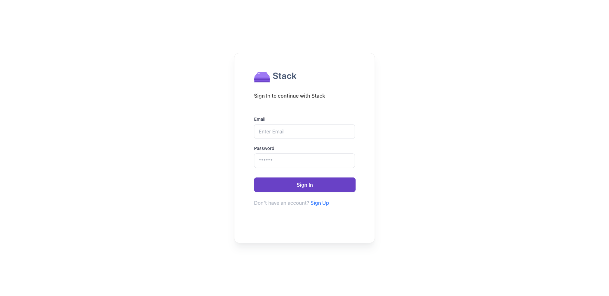
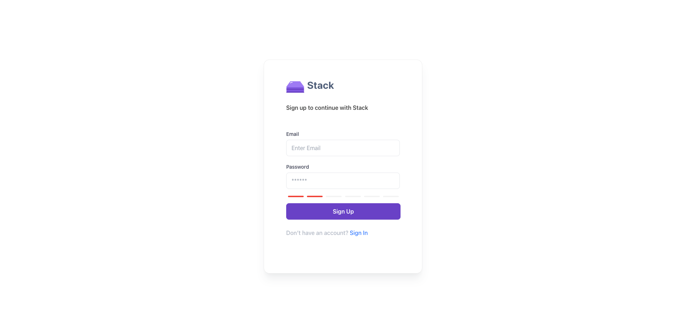
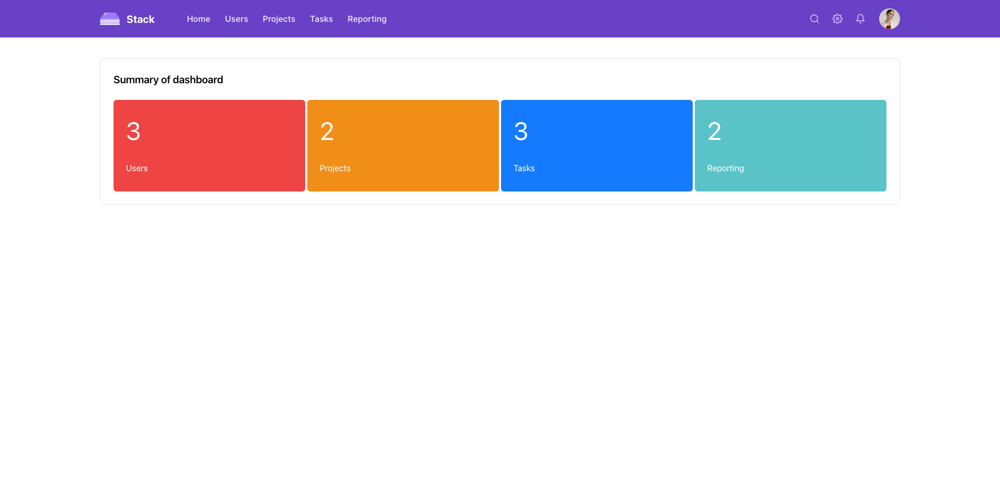
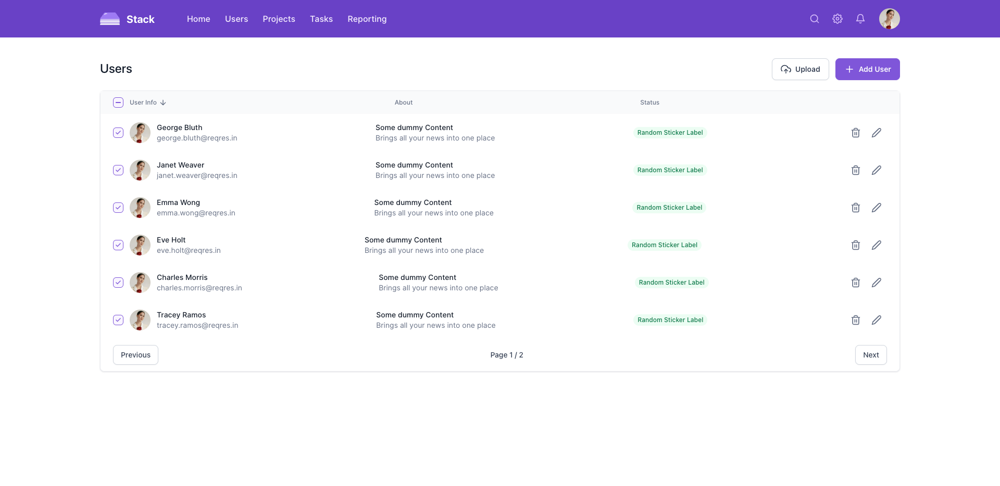

# Stack Dashboard

## Features
- Signin
- Signup
- Dashboard
- Users list

## Scripts
- `dev`/`start` - start dev server and open browser
- `build` - build for production
- `preview` - locally preview production build
- `test` - launch test runner

## Signin

## Signup

## Dashboar Home

## Users list
